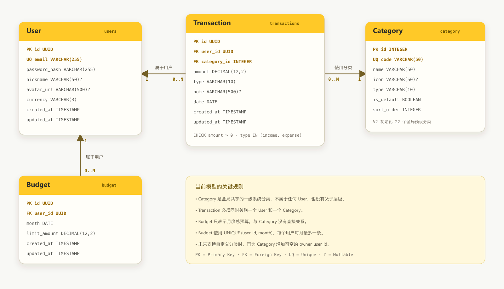

# Bookkeeping 数据库 UML

> 本图描述当前已经落地的数据库结构，以
> [`V1__init_schema.sql`](./bookkeeping-api/src/main/resources/db/V1__init_schema.sql)
> 和 [`V2__seed_default_categories.sql`](./bookkeeping-api/src/main/resources/db/V2__seed_default_categories.sql)
> 为准。

## 完整 UML 图



如果 Markdown 查看器没有显示图片，可以直接打开：
[`docs/database-uml.png`](./docs/database-uml.png)

可编辑的矢量版本：[`docs/database-uml.svg`](./docs/database-uml.svg)

## 纯文本关系

```text
User      1 ───── 0..N Transaction
Category  1 ───── 0..N Transaction
User      1 ───── 0..N Budget
```

## 表职责

| 表 | 职责 |
|---|---|
| `users` | 用户身份、默认币种和个人资料 |
| `category` | 全局共享的系统预设一级分类 |
| `transactions` | 用户的收入与支出记录，每笔记录必须关联一个分类 |
| `budget` | 用户的月度总预算，每个用户每月最多一条 |

## 关键约束

- `users.email` 全局唯一。
- `category.code` 全局唯一，`type` 只能是 `income` 或 `expense`。
- `transactions.amount` 必须大于零，交易必须同时关联 User 和 Category。
- `budget` 使用 `UNIQUE (user_id, month)` 保证每个用户每月最多一条预算。
- Category 与 User、Budget 都没有直接关系。

## 未来自定义分类扩展

未来真正实现用户自定义分类时，可以通过新迁移为 `category` 增加可空的
`owner_user_id`：为空表示系统分类，有值表示该用户创建的分类。如果还需要用户隐藏、
重命名或重新排序系统分类，再增加 `user_category_preference` 表。以上扩展均不属于当前数据库模型。
